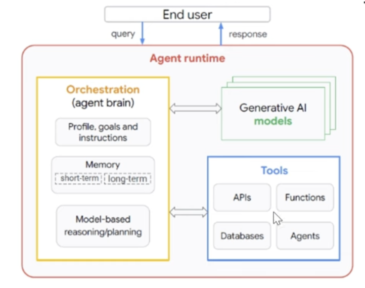
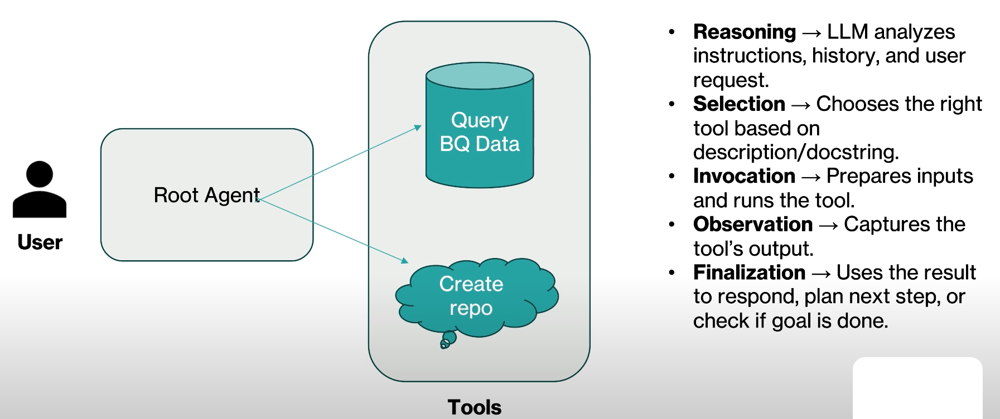

- [What we are solving](#what-we-are-solving)
- [Google ADK](#google-adk)
  - [Components of ADK](#components-of-adk)
- [Agent Engine](#agent-engine)
- [Agentspace](#agentspace)
- [Tools in ADK](#tools-in-adk)
  - [How Tool works?](#how-tool-works)
  - [Types of Tools](#types-of-tools)
- [Hands-On with ADK](#hands-on-with-adk)
- [Commands](#commands)
- [Tools Vs Sub-Agent](#tools-vs-sub-agent)
  - [🔹 1. Tools](#-1-tools)
  - [🔹 2. Subagents](#-2-subagents)
  - [🔹 3. Putting it Together](#-3-putting-it-together)
  - [✅ When to use which:](#-when-to-use-which)
  - [Demo](#demo)


# What we are solving


# Google ADK
Agent Development Kit (ADK) is a flexible and modular framework for developing and deploying AI Agents. While optimized for Gemini and the Google ecosystem, ADK is model-agnostic, deployment-agnostic, and is built for compatibility with other frameworks.

## Components of ADK


- Agent Runtime


# Agent Engine


# Agentspace


# Tools in ADK
- In ADK tools means a special ability given to an AI Agent.
- Example: If I am asking a Gemini about a BigQuery it will help me, however if I ask to query my BQ Table data, it won't be able to answer that because it does not have any external integration to connect with the Google BQ. So in such case Tools will help.
- Tools lets agent **do actions** and **interact with the world**, beyond just writing text or reasoning. So, LLM's will be having a special capability of accessing external data along with generative capabilities, writing or reasoning capability.
- What makes an agent powerful - is how well it **uses tools** compared to a basic langiage model.  
- A tool is usually a **small code unit**, either it is pre-built, handled by python library or we can write our own Python function and call it as a tool, or can use built-in tools just like a google search and so on. There are multiple options are available using a tool.
- Each tool is built to do **one clear task** or **specifici task**. A tool does not perform a lot of task that LLM wil do. 
- The task often involves working with external systems or data.
- Tools perform specific Actions such as
  - Querying Database
  - Making API requests (eg fetching weather data, booking systems)
  - Seaching the web
  - executing code snippets.
- 

## How Tool works?
Lets understand with an example, where we have a Root Agent with two tools attached to it, and User is interacting with this root agent. 
User has prompted with some question, here user does not know what tools exists or what tool to use.
Then how our agent wil understand which tool to use? There are certain steps involved at the backend while our agent execute a tool, or it start using a tool, or decide which tool to use. 

Let's see what are these backend steps or what happens at the backstage when you start using the tools.
Agent's will decide based on the user query which tool to call and which function to execute.



- First is Reasoning. So all LLM models comes with the reasoning capability. In our case we are using Gemini. 
  - Reasoning: LLM analyzes instructions, histroy and user's request.
  - The user prompts or ask to give me the top 10 records from my Bigquery table.
  - Now the LLM model with the reasoning capability it will identify a user's query / prompt / ask is related to a big query. So it will select the BigQuery tool, based on the description or doc string. Now this descrtipion or doc string is a description of your agent, it will decide based on the description of the agent or sub-agent where to route your request. Once it decide I need to query a BQ data then it invoke the BQ data along with some inputs. And also it will capture the tools output.  

So in-short, Based on the User's input, Agent apply their own reasoning capability. LLM used will decide which tools to invoke. All this is based on Description and Prompt. Thus we should always give better description and better prompts to perform the agent in a more efficient way.


## Types of Tools
- Built-In Tools
- Function Tool
- Third-Party Tool

ADK offers flexibility by supporting several types of tools:
1. Function Tools: Tools created by Developer / You, tailored to our specific application's need.
   - Functions / Methods: Define standard synchronous functions or methods in our code (eg Python def)
   - Agents-as-Tools: Use another, potentially specialized, agent as a tool for a parent agent.
   - Long Running Function Tools: Support for tools that perform asynchronous operations or take significant time to complete.
2. Built-in Tools: Ready-to-use tools provided by the framework for common tasks. No code required, just import and use it. Examples: Google Search, Code Execution, RAG, BigQuery etc.
3. Third-Party Tools: Integrate tools seamlessly from popular external libraries. Example: LangChain Tools, CrewAI Tools.


# Hands-On with ADK
[Star with simple](/Google_ADK/01_Starter/Steps.md)
[Demo on Tools]()


# Commands

1. Create Files for Agent
To create 
```sh
mkdir 01_create_config

cd 01_create_config

adk create --type=config demo_agent
# It will prompt to choose Model for Root Agent: Either Gemini or Others.
# If goign with Gemini Model, then it will ask to choose from Google AI or Vertex AI.
# With Google AI we would need API Key which can be generated from Google AI Studio, and with Vertex AI, it will use user application credentials.
# Then it will create `.env`, `__init__.py` and `root_agent.yaml` files.
```


# Tools Vs Sub-Agent
## 🔹 1. Tools
* What are tools?
    Tools are functions/APIs/utilities that an agent can directly call to accomplish tasks.

    Examples:
  * A REST API call wrapper
  * A SQL database query tool
  * A Google Cloud service call (BigQuery, Vertex AI Search, etc.)

* When you use `tools=[]`:
    * The root agent has the capability to directly execute these functions.
    * The agent decides: “Do I need to answer from my own reasoning or do I need to call a tool?”
    * This is useful when the task is atomic and direct (one agent handling everything, just needing helpers).

* Analogy: You are a single worker (root agent) who has a toolbox (tools) — you pick up a wrench or screwdriver when you need them.

## 🔹 2. Subagents
* What are subagents?
    Subagents are other agents — each can have their own reasoning, tools, memory, and instructions.
    
    They behave like specialized teammates.

    Example:
    * Root agent = “Customer Support Orchestrator”
    * Subagent A = “Billing Assistant”
    * Subagent B = “Tech Support Assistant”
    * Subagent C = “Knowledge Base Lookup Assistant”

* When you use `subagents=[]`:
    * The root agent doesn’t directly handle all tasks itself.
    * Instead, it delegates: “Which subagent is best for this?”
    * This is useful when the problem space is broad or specialized and you want modular, reusable agents.

* Analogy: You are a manager (root agent) who assigns tasks to different team members (subagents). Each teammate might have their own tools to get the job done.

## 🔹 3. Putting it Together
    You can mix tools and subagents in the same root agent.

    Example setup:
    ```python
    root_agent = Agent(
        instructions="Main Orchestrator",
        tools=[bigquery_tool, search_tool],   # direct helpers
        subagents=[billing_agent, support_agent]  # delegate when needed
    )
    ```

## ✅ When to use which:
* Use tools if the action is low-level and reusable, like calling an API, running SQL, or fetching a file.
* Use subagents if the action is higher-level, domain-specific, or conversational, where reasoning and specialization are needed.


## Demo
👍 Let’s build a mini hands-on example where a root agent can either:
* directly use a tool (to run a math calculation), or
* delegate to a subagent (to answer knowledge questions).

This mirrors how you’ll see `tools=[]` and `subagents=[]` in Google Cloud ADK.

