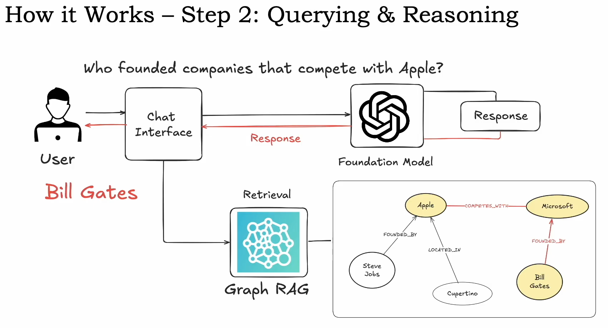

# GraphRAG

* Step 1: Data Ingestion
    Documents are processed into embeddings, and entities are extracted.
* Step 2: Graph COnstruction
    Entities like people, companies and events become nodes, and their relationships form edges in a knowledge graph.
* Step 3: Query Processing
    System looks at both text embeddings and graph connections.
* Step 4: Context retrieval
    Pulls relationships and structured context.
* Step 5: Answer generation

# GraphRAG Use Cases
- Healthcare: linking patients, symptoms, drugs, and treatments.
- Finance: Mapping company ownership, acquistions, and risk factors.
- Academic Reasarch: Discovering novel connections between existinf research.
- Legal: Tracing hiw different laws, cases, and precedents are connected.
- Customer Support: Identifying how different support tickets are related to recussing issues.
- Enterprise Search: Findings insights across corporate reports.

# GraphRAG Vs Basic RAG

# LangChain - LangGraph Architecture
[LangGraph](https://python.langchain.com/docs/how_to/graph_constructing/)

