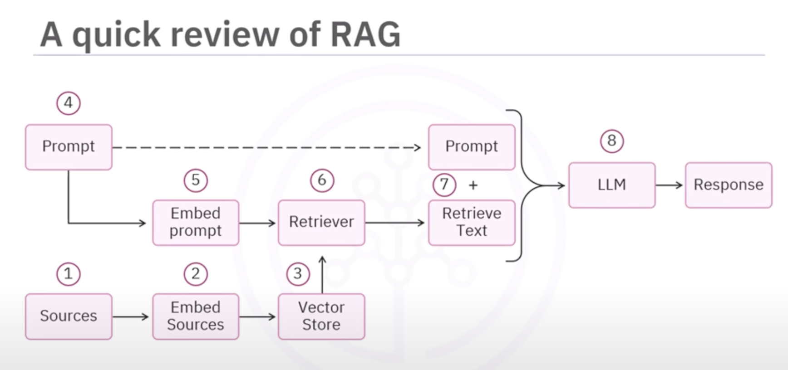

# RAG

# The problem
- First, lets understand what problem RAG is trying to solve.
- Think of a hospital. Every day, doctors and staff create many records, lab reports, prescriptions, patient details, and so on. After some years, this becomes thousands of PDF files stored in the system.
- Now if the doctor asked - 
    "Can you show me the recent lab results for Patient ID 245?"
    This looks simple, but in reality:
- Searching hundreds of files by hand is very slow.
- If you ask a mormal AI like ChatGPT, it cannot help. Why? Because it does nto know about your hospital's private data. It only knows general medical facts from the internet.
- You might think: 'okay, then lets just upload all these files to the LLM'. But the prpblem is.. that's not rally possible.
- Here's why
  - Every LLM has something called a context window. Think of it like a box it can only fit a limited amount of text at a time. Thousands of records simply won't fit in.
  - Even if you somehow pushed everything inside, it would be very slow and very expensive to do this again and again.
- Now the big question is what would the ideal system look like?
- well, the ideal system should be smart. It should
  - Search only the doc that matter for the question
  - Pick out the exact pieces of text that are useful
  - send just those pieces to the LLM.
  - And then let the LLM generate the final answer in a clear way.
  - And this is exactly what RAG or Retrival-Augmented Generation, does.
- It's like giving the LLM a smart assistant one that quickly finds the right files, and the lets the AI explain them in simple language.

Alright, now that we know wht we need RAG, lets understand how it actaully works step by step.

Think of it like this: RAG has two main parts Retrievek and Generation.

Step 1: Break the data into chunks
    First, we take all the documents PDF's, reports, notes and break them into smaller pieces of text.
    
    Why? Because AI understands better when the text is in small, clear chunks instead of huge paragraphs.

    Its like cutting a big cake into slices much easier to serve and eat.

Step 2: Create embeddings
    Next, we convert each chunks of text into numbers. These numbers are called embeddings. They capture the meaning of the text.

    For example, if one chunk talks about "blood tests" and another talks about "lab reports", their embeddings will be very close, becuase they mean similar things.

Step 3: Store embeddings in a database
    All these embeddings ate stored in a special database called a vector database.

    This database i slike a smart library that doesn't just match words, it matches meanings.

Step 4: Retrieve relevant chunks
    Now, when a doctor asks: "can you show me the revent lab results for patient id 245?"

    RAG wil take this question, turn it into an embeddings, and then searcg the database for the closest matching chunks. So instead of reading all the files, it quickly finds just the right pieces.

Step 5: Send to the LLM
    Those relevant chinks are then passed to the LLM - in our case, Google Gemini.
    Now Gemini has the context it needs.
    It knows both:
        - the doctor's question
        - the exact patient records relevant to that question.
  
Step 6: Generate the final answer.
    Finally, Gemini uses its language skills to give a clear, human-like answer:

    Something like "Patient ID 245 had lab tests on Janurary 5th, March 12th and June 20th. The results were ..."

    And thats the magic of RAG.
    - Its not about making the LLM memorize everything.
    - Its about teaching it how to find the right information at the right time.

 

