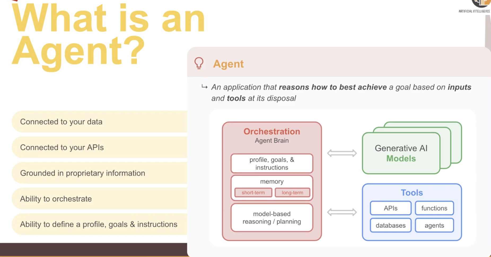
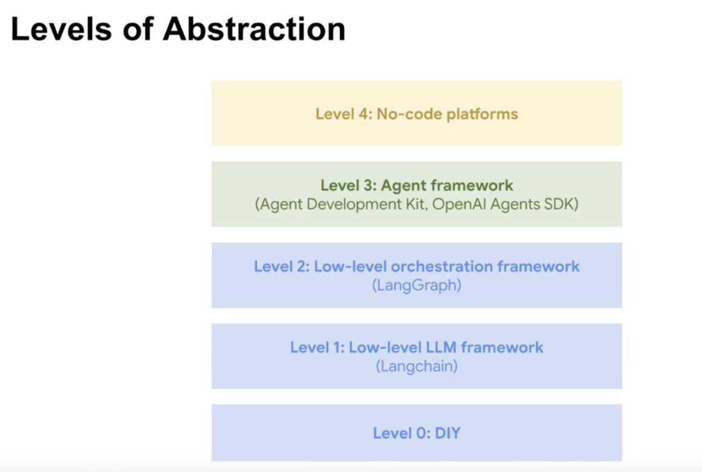

Understanding the core terms in the “agentic AI” world makes the rest much easier.


# Agents
**Layman terms:**

Think of an Agent like a very smart hospital intern.

* A patient asks a question: “Can you check my medication list and tell me if I’m allowed to take Ibuprofen?”

* The intern doesn’t know everything directly — but they know how to:

  * Look into the patient’s electronic health record (EHR).

  * Check the medication interaction system.

  * Summarize the answer in simple words.

The intern is the `Agent`: it doesn’t just “answer” — **it decides what tools to use**, in what order, and brings back a useful result.

**Technical terms:**

* In LangChain / ADK, an Agent =
  * LLM (the brain) +
  * Tools (functions/APIs it can call) +
  * Policy/Planner (logic that decides which tool to call, and when)

* For example:
  * LLM = Gemini or GPT model
  * Tool = “fetch patient medications from FHIR API”, “query drug-drug interaction database”
  * Planner = The reasoning loop: “Step 1: get patient meds → Step 2: check interactions → Step 3: explain in plain English.”

Code Example
```python
# Google ADK
from google.adk.agents import Agent

agent = Agent(
    name="medication_agent",
    model="gemini-2.0-flash",
    tools=[
        get_patient_meds, check_drug_interactions
        ],
    instruction="Help clinicians check for medication interactions using EHR data."
)
```
Then, when a doctor types:
**"Is Ibuprofen safe for patient 123?"**

The Agent:
1. Embeds the request →
2. Calls get_patient_meds(patient_id=123) →
3. Calls check_drug_interactions(meds, "Ibuprofen") →
4. Writes back a safe summary.



# MCP Server


# Core-Terms
| Term                                     | Layman Explanation                                                 | Technical Explanation                                     | Healthcare Example                                                      |
| ---------------------------------------- | ------------------------------------------------------------------ | --------------------------------------------------------- | ----------------------------------------------------------------------- |
| **Agent**                                | A smart intern that knows how to use hospital systems              | LLM + Tools + Planner                                     | An agent that fetches lab results and explains them to patients         |
| **Tool**                                 | A “button” the agent can press                                     | A Python function, API, or service the agent can call     | Tool = “Get lab results from Epic FHIR API”                             |
| **Prompt**                               | How you ask the intern what to do                                  | Structured text instruction for the LLM                   | “Summarize this discharge summary in simple terms for a patient”        |
| **Chain** (LangChain)                    | A recipe of steps always followed                                  | A fixed sequence of calls (LLM → embed → search → answer) | Always: take doctor note → embed → search guideline → summarize         |
| **RAG** (Retrieval-Augmented Generation) | Like the intern looking into the hospital library before answering | LLM + Vector Search (retrieve facts before generation)    | Fetch oncology guidelines before answering patient treatment questions  |
| **Memory**                               | The intern remembers what you asked before                         | Storing conversation context / embeddings                 | A chatbot remembers a patient’s last 3 symptoms reported                |
| **Vector Store / Index**                 | A “library card catalog” for quick lookup                          | Database of embeddings for semantic search                | Store all clinical trial documents and search by meaning                |
| **Planner**                              | The intern’s reasoning: “first check labs, then suggest”           | Logic layer in an agent (decides tool order)              | ADK/Gemini deciding: Step 1: get vitals → Step 2: query risk calculator |


# Healthcare Example in Action (RAG + Agent)

**Layman flow (like a nurse assistant):**

1. Doctor asks: “What were the patient’s last blood sugar levels, and what guideline do we follow if it’s >200 mg/dl?”

2. Agent:
   * Looks in EHR → finds lab results
   * Looks in clinical guideline docs (vector search)
   * Explains: “Patient had 220 mg/dl, guideline says initiate insulin adjustment.”

**Technical flow:**
* LLM receives the query
* Planner decides: call get_lab_results + call search_guidelines
* Vector search fetches relevant docs → passed into context
* LLM generates final answer with citations

✅ So:
* Agent = the decision-maker + reasoning brain
* Tools = hospital systems/APIs it can use
* Planner/Policy = decides sequence of actions
* RAG = makes sure answers are backed by documents

# Level of Abstraction



# Agent-To-Agent (A2A)

